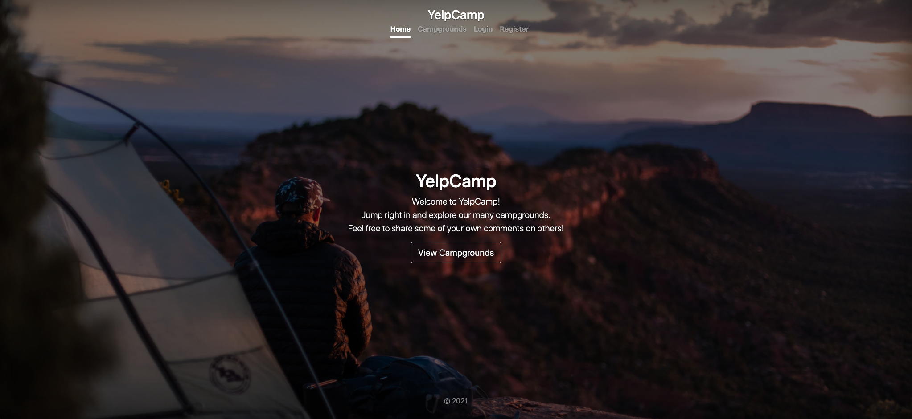
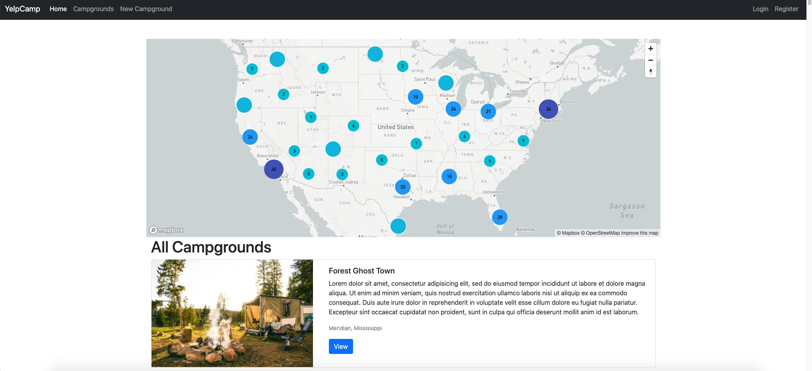
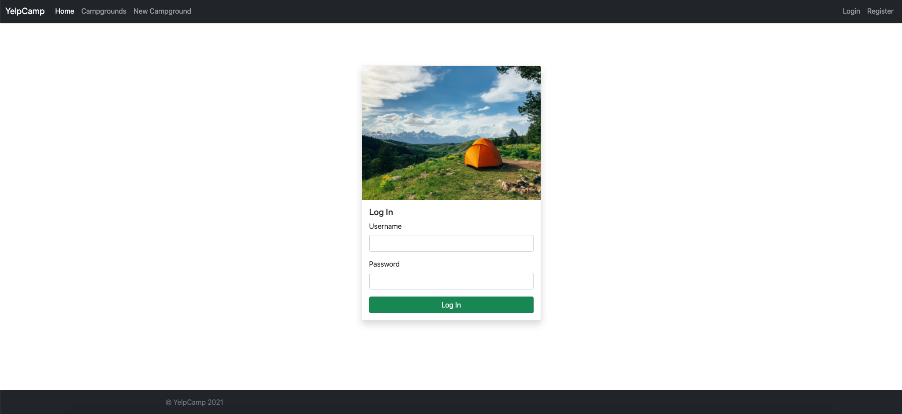
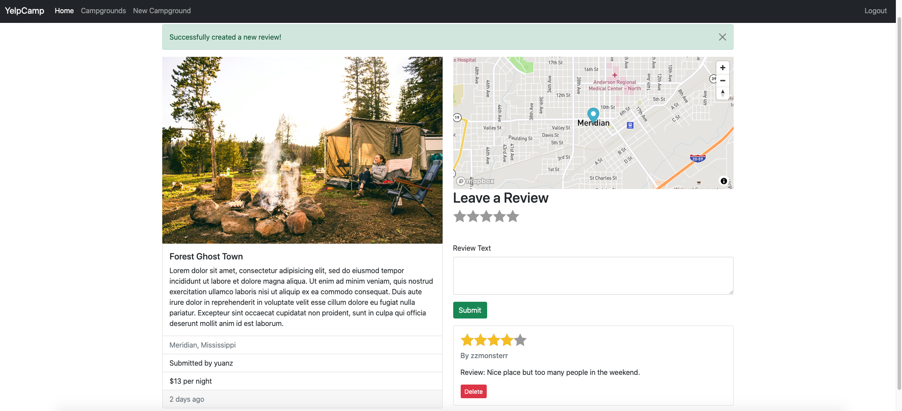

# YelpCamp
Final output website: [https://acieffe-yelp-camp.onrender.com/](https://acieffe-yelp-camp.onrender.com/)

# Overview

- **Home page**

  

- **List of all campgrounds**

  

- **Register** **/ Log In**

  To add new campground, edit the campground you created and write and edit your review.

  

  - Log in as the reviewer's creater: you can delete your review.

  

  - Log in as the campground's creater: you can edit and delete the campground, but cannot modify its review created by other people.

  

# How to run it locally

1. after download, run `npm i` to install all node_modules needed.
2. open two terminals:
   - `cd` to this directory (YelpCamp), then `nodemon app.js` to connect to local MongoDB.
   - Run `mongo` in another terminal to see `yelp-camp` db.

# git push issue
Our own git repo will not update automatically after we push to Heroku side.
So, in order to keep our own git repo also up to date,
1. Push to Heroku: git push heroku main
2. Push to own git repo: git push
